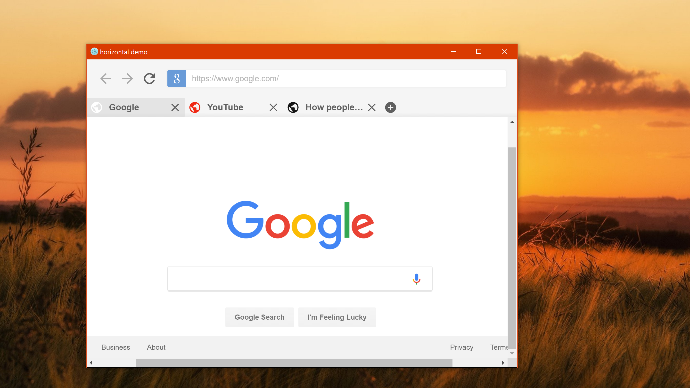
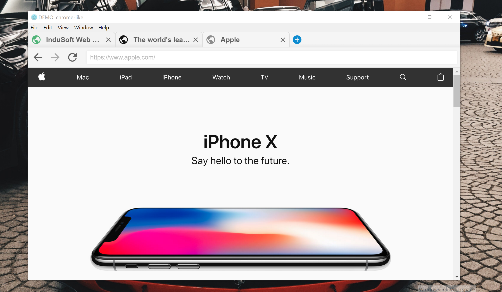
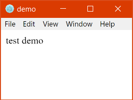
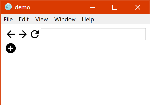

# electron-navigation


### Adds a navigation interface to Electron that allows you to browse the internet or view local HTML files with tabs and webviews.



# Install 
```
npm i electron-navigation
```
> Confused? Go through the [Setup](#setup) for a full guide.   
> Know what you are doing? Skip to the [Usage](#usage) section.


<p align="center" style="color:black;">
    <a href="#setup" style="color:grey;">SETUP</a> |
    <a href="#usage" style="color:grey;">USAGE</a> |
    <a href="#themes" style="color:grey;">THEME</a> |
    <a href="#options" style="color:grey;">OPTIONS</a> |
    <a href="#methods" style="color:grey;">METHODS</a> |
    <a href="#more" style="color:grey;">MORE</a> |
    <a href="#history" style="color:grey;">HISTORY</a> |
    <a href="#meta" style="color:grey;">CONTACT</a>
</p>

# Setup
> This works with electron, so let's get a basic electron app going.


1. Create a folder; we'll call this one **demo**. In that folder create these three files.
    ```
    demo/
    ├── package.json
    ├── index.js
    ├── index.html
    ```

2. Let's populate these files with some basic code.  

	FILE: package.json
    ```json
    {
      "name": "demo",
      "version": "1.0.0",
      "description": "",
      "main": "index.js",
      "scripts": {
        "start": "node_modules\\electron\\dist\\electron ."
      },
      "author": "",
      "license": "ISC"
    }
    ```

    FILE: index.js
    ```javascript
    const {
        app,
        BrowserWindow
    } = require('electron');

    let win;

    app.on('ready', () => {

        win = new BrowserWindow({
            width: 800,
            height: 600
        });

        win.loadURL(`file:///${__dirname}/index.html`);

        win.on('closed', () => {
            win = null;
        });

    });
    ```
	FILE: index.html
    ```html
    <!DOCTYPE html>
    <html>
      <head></head>
        <body>

		  test demo
        
        </body>
    </html>
    ```
    
3. Time to test if it works. Open up your command prompt (windows) and type these commands hitting *enter* after each one. Make sure you have Node.js installed which can be found [here](https://nodejs.org/en/download/).
    ```
    cd "C:\location\of\your\folder\demo"
    npm i electron-navigation
    npm start
    ```
	

4. From here on out if you leave your command prompt window open to the demo directory, you can run your app by typing.
	```
    npm start
    ```

<p align="center" style="color:black;">
    <a href="#setup" style="color:grey;">SETUP</a> |
    <a href="#usage" style="color:grey;">USAGE</a> |
    <a href="#themes" style="color:grey;">THEME</a> |
    <a href="#options" style="color:grey;">OPTIONS</a> |
    <a href="#methods" style="color:grey;">METHODS</a> |
    <a href="#more" style="color:grey;">MORE</a> |
    <a href="#history" style="color:grey;">HISTORY</a> |
    <a href="#meta" style="color:grey;">CONTACT</a>
</p>

# Usage
1. In your main **~.html** file you need to create **3** containers where the controls, tabs, and views will be auto placed into. The demo uses **index.html** as it's main file.
    EXAMPLE: index.html
    ```html
    <body>
    <!-- your code here -->

      <div id="nav-body-ctrls"></div>
      <div id="nav-body-tabs"></div>
      <div id="nav-body-views"></div>

    </body>
    ```
    NOTE:   
    * The **IDs** are important. Make sure they are spelled correctly.    
    * If you don't want your users to control the pages you can get rid of the controls container. The ID for that is **nav-body-ctrls** .  
    * The order or location of these divs doesn't matter, and they also don't have to be div elements. For example: `<main id="nav-body-views"></main>`.
	
2. Now we need to apply the module by adding a script tag to the **~.html** file so that it can add the tabs and controls to the containers we just created above.	

    EXAMPLE: index.html
    ```html
    <!-- your code here -->
	<div id="nav-body-ctrls"></div>
    <div id="nav-body-tabs"></div>
    <div id="nav-body-views"></div>
    
    <script>
        const enav = new (require('electron-navigation'))();
    </script>

    </body>
    ```
3. Now that we have this, let's give it a quick run. If you've been following the setup guide, it would be like this.  

    ```
    npm start
    ```
    

> This should be all you need to get the basic functionality working. If you are confused and want some more examples including how to use **local html files** in the tabs then check out the [demos](https://github.com/simply-coded/electron-navigation/tree/master/demos) on github.

<p align="center" style="color:black;">
    <a href="#setup" style="color:grey;">SETUP</a> |
    <a href="#usage" style="color:grey;">USAGE</a> |
    <a href="#themes" style="color:grey;">THEME</a> |
    <a href="#options" style="color:grey;">OPTIONS</a> |
    <a href="#methods" style="color:grey;">METHODS</a> |
    <a href="#more" style="color:grey;">MORE</a> |
    <a href="#history" style="color:grey;">HISTORY</a> |
    <a href="#meta" style="color:grey;">CONTACT</a>
</p>

# Themes
### You can apply themes by downloading the ones on [github](https://github.com/simply-coded/electron-navigation/tree/master/themes) and putting them in your `<head>` tag.  

EXAMPLE: index.html
```html
<head>
  <!-- your code here -->
    
  <link rel="stylesheet" href="relative/location/of/theme.css">
</head>
```

### The themes folder also has a template theming file that you can use to style the tabs and controls exactly how you wish. 

FILE: theme-template.css
```css

/* back button, grouped in: .nav-icons */
#nav-ctrls-back {
    /* fill:#000; width:24px; height:24px; */
}


/* back button with no history, grouped in: .nav-icons.disabled */
#nav-ctrls-back.disabled {
    /* pointer-events:none; opacity:0.5; */
}
```

<p align="center" style="color:black;">
    <a href="#setup" style="color:grey;">SETUP</a> |
    <a href="#usage" style="color:grey;">USAGE</a> |
    <a href="#themes" style="color:grey;">THEME</a> |
    <a href="#options" style="color:grey;">OPTIONS</a> |
    <a href="#methods" style="color:grey;">METHODS</a> |
    <a href="#more" style="color:grey;">MORE</a> |
    <a href="#history" style="color:grey;">HISTORY</a> |
    <a href="#meta" style="color:grey;">CONTACT</a>
</p>

# Options
### You can control how and if some elements are displayed by passing an options object through the main electron-navigation object.  
```js
const enav = new (require('electron-navigation')( { HERE } );
```
### __{ showBackButton : `<boolean>` }__
> Shows/hides the back button in #nav-body-ctrls. Defaults to `true`.

### __{ showForwardButton : `<boolean>` }__
> Shows/hides the forward button in #nav-body-ctrls. Defaults to `true`.

### __{ showReloadButton : `<boolean>` }__
> Shows/hides the reload button in #nav-body-ctrls. Defaults to `true`.

### __{ showUrlBar : `<boolean>` }__
> Shows/hides the url input in #nav-body-ctrls. Defaults to `true`.

### __{ showAddTabButton : `<boolean>` }__
> Shows/hides the add button in #nav-body-tabs. Defaults to `true`.

### __{ closableTabs : `<boolean>` }__
> Shows/hides the close button on tabs in .nav-tabs-tab. Defaults to `true`.

### __{ verticalTabs : `<boolean>` }__
> Changes the direction tabs are stacked in #nav-body-tabs. Defaults to `false`.

### __{ defaultFavicons : `<boolean>` }__
> Uses the default favicons instead of the unified color coded ones in .nav-tabs-tab. Defaults to `false`.

### __{ newTabCallback : `<function>` }__
> Before a tab is created, an optional callback is invoked with `(url, options)`. It can be set for the `ElectronNavigation` instance or passed inside `newTab()` as an option.
>
> Optionally, the `url` and `options` can be altered and returned inside the callback result.
> The callback may define a `postTabOpenCallback`, which will receive the created `webview`.
>
> If a falsy value is returned, the tab will not be created.

```js
// Simple callbacks which does not alter the parameters
(url, options) => {
    return true;
}

// Prevent tab creation
(url, options) => {
    return false;
}

// Callback which redirects the opened tab
// Altered parameters imply that the tab should be shown
(url, options) => {
    url = "about:blank";
    return {url};
}

// Invoke callback after webview creation
(url, options) => {
    options.postTabOpenCallback = webview => {
        console.info("New webview created: ", webview);
    }
    return {options};
}
```
### __{ newTabParams : `<function|array>` }__
> Parameters to pass to `newTab()` when a new tab is opened by the new tab button. The parameters may be an array or a function that returns an array. Defauls to `['http://www.google.com/', {
                              close: options.closableTabs,
                              icon: NAV.TAB_ICON
                          }]`.
### __{ changeTabCallback : `<function>` }__
> Function to invoke with visible `webview` after a new tab has become visible.
```js
// all options and their default values if omitted.
let options = {
    showBackButton: true,
    showForwardButton: true,
    showReloadButton: true,
    showUrlBar: true,
    showAddTabButton: true,
    closableTabs: true,
    verticalTabs: false,
    defaultFavicons: false,
    newTabCallback: null
}

```
EXAMPLE : index.html 
```html
<script>    
    // the order doesn't matter    
    const enav = new (require('electron-navgation')) ({
        showAddTabButton: false,
        showUrlBar: true,
        showReloadButton: false
    });    
</script>
```

<p align="center" style="color:black;">
    <a href="#setup" style="color:grey;">SETUP</a> |
    <a href="#usage" style="color:grey;">USAGE</a> |
    <a href="#themes" style="color:grey;">THEME</a> |
    <a href="#options" style="color:grey;">OPTIONS</a> |
    <a href="#methods" style="color:grey;">METHODS</a> |
    <a href="#more" style="color:grey;">MORE</a> |
    <a href="#history" style="color:grey;">HISTORY</a> |
    <a href="#meta" style="color:grey;">CONTACT</a>
</p>

# Methods
### You can control the webviews and tabs using the object variable you created.  
```js
const HERE = new (require('electron-navigation'))();
```
### __.newTab ( `url` , `options` )__
> ### __url__ `<string>` [*required argument*] - Specifies the location of the webview. Will perform a search if no domain specified.
>```js
> "http://github.com/"  // "http://github.com/"
> "youtube.com"         // "http://www.youtube.com/"
> "hello there"         // "https://www.google.com/search?q=hello+there"
> ```
> ### __options__ `<object>` [*optional argument*] - Controls the tab appearance. All KVPs are optional and orderless.
>> ### __{ id :__ `<string>` __}__ - Creates an `ID` for this tab's view so you can control it later. Logs an error if the `ID` is already taken or invalid. Defaults to `null`.
>> ### __{ node :__ `<boolean>` __}__ - Allows the webview to use Node.js, and is only recommended for local files. Defaults to `false`.
>> ### __{ readonlyUrl :__ `<boolean>` __}__ - Sets the main URL text input to readonly mode on this tab. Defaults to `false`.
>> ### __{ contextMenu :__ `<boolean>` __}__ - Enables right-click context menu by [electron-context-menu](https://github.com/sindresorhus/electron-context-menu). Bit buggy. Defaults to `true`.
>> ### __{ webviewAttributes :__ `<object>` __}__ - Specifies additional attributes to pass to the webview tag. Defaults to `{}`.
>> ```js
>> // example for passing a custom user agent
>> let google = enav.newTab('https://www.google.com/', {webviewAttributes: {
>>   useragent: "Super secret browser"   
>> }});
>> ```
>> ### __{ newWindowFrameNameBlacklistExpression:__ `<RegExp>` __}__ - Whenever a window is opened through `window.open()`, a `new-window` event is emitted automatically. This option allows to specify frame names that should not trigger the creation of a new tab. 
>> ```js
>> {newWindowFrameNameBlacklistExpression: /internallyOpened|popup[0-9]/i}
>> ```
>> ### __{ icon :__ `<string>` __}__ - Changes the favicon. Defaults to `"clean"`.
>> ```js
>> {icon: "default"}      // uses the regular favicon.
>> {icon: "clean"}        // uses a constant globe icon that is colored based on the default favicon.
>> {icon: "/path/to/image.png"}   // uses an icon you provide. Full or relative paths and other extensions are allowed.
>> ```
>> ### __{ title :__ `<string>` __}__ - Changes the title of the tab. Defaults to `"default"`.
>> ```js
>> {title: "default"}         // uses the title specified by the <title> tag.
>> {title: "custom title"}    // uses whatever title you type.
>> ```
>> ### __{ close :__ `<boolean>` __}__ - Shows/hides the close button. Defaults to `true`.  
> ```js
> // all options and their default values if omitted.
> let options = {
>     id: null,  
>     node: false,
>     readonlyUrl: false,
>     contextMenu: true, 
>     webviewAttributes: {},
>     icon: "clean",      
>     title: "default",   
>     close: true       
> }
> ```
> ### __return__ `<object>` - The webview element object. Allows you to use the properties and methods as described here [Element API](https://developer.mozilla.org/en-US/docs/Web/API/Element).
>```js
> // example on how to allow plugins
> let google = enav.newTab('http://www.google.com/');
> google.setAttribute('plugins', '');
>
> // check if it has node integration
> if (google.hasAttribute('nodeintegration')) 
>   alert('yes, you can use node in this tab.');
> else 
>   alert('no, you cannot use node in this tab.');
>```

### __.changeTab ( `url` , `id` )__
> ### __url__ `<string>` [*required argument*] - Specifies the new location of the webview. Has the same auto features as **newTab()**.  
> 
> ### __id__ `<string>` [*optional argument*] - Changes the source of the webview with the `ID` specified in __newTab()__. If no `ID` is given the active tab and view are affected. Will console.log an error if the `ID` doesn't exist.

### __.closeTab ( `id` )__
> ### __id__ `<string>` [*optional argument*] - Closes the tab and webview with the `ID` specified in __newTab()__. If no `ID` is given the active tab and view are affected. Will console.log an error if the `ID` doesn't exist.

### __.back ( `id` )__
> ### __id__ `<string>` [*optional argument*] - Goes back on the webview with the `ID` specified in __newTab()__. If no `ID` is given the active tab and view are affected. Will console.log an error if the `ID` doesn't exist.

### __.forward ( `id` )__
> ### __id__ `<string>` [*optional argument*] - Goes forward on the webview with the `ID` specified in __newTab()__. If no `ID` is given the active tab and view are affected. Will console.log an error if the `ID` doesn't exist.

### __.reload ( `id` )__
> ### __id__ `<string>` [*optional argument*] - Reloads the webview with the `ID` specified in __newTab()__. If no `ID` is given the active tab and view are affected. Will console.log an error if the `ID` doesn't exist.

### __.stop ( `id` )__
> ### __id__ `<string>` [*optional argument*] - Stops loading the webview with the `ID` specified in __newTab()__. If no `ID` is given the active tab and view are affected. Will console.log an error if the `ID` doesn't exist.

### __.openDevTools ( `id` )__
> ### __id__ `<string>` [*optional argument*] - Opens the developer tools for the webview with the ``ID`` specified in __newTab()__. If no `ID` is given the active tab and view are affected. Will console.log an error if the `ID` doesn't exist.

### __.printTab ( `id`, `options` )__
> ### __id__ `<string>` [*optional*] - Trigger electron print for the webview with the `ID` specified in __newTab()__. If no `ID` is given the active tab and view are affected. Will console.log an error if the `ID` doesn't exist.
> ### __options__ `<object>` [*optional argument*] - Electron print options, if nothing is passed the default print dialog will show up. 
>> ### __{ silent:__ `<boolean>` __}__ [*optional argument*] - Don't ask user for print settings. Defaults to `false`.
>> ### __{ printBackground:__ `<boolean>` __}__ [*optional argument*] - Also prints the background color and image of the web page. Defaults to `false`.
>> ### __{ deviceName:__ `<string>` __}__ [*optional argument*] - Set the printer device name to use. Defaults to `''`.

### __.nextTab (  )__
> Switch focus to next available tab (goes to the first one if the last is active).

### __.prevTab (  )__
> Switch focus to previous available tab (goes to the last one if the first is active).

### __.send ( `id`, `channel`, `args` )__
> ### __id__ `<string>` - Sends a message to the webview with the `ID` specified in __newTab()__. Will console.log an error if the `ID` doesn't exist.  
> ### __channel__ `<string>` - A channel name of your choosing to keep track of messages.  
> ### __args__ `<array>` - A list of arguments to send to the webview.
>```js
> enav.send('webviewIdHere', 'channelNameHere', ['arg', 'list', 'here'])
>```
> * See `demos/demo4*` for examples.


### __.listen ( `id`, `callback` )__
> ### __id__ `<string>` - Listens for a message from the webview with the `ID` specified in __newTab()__. Will console.log an error if the `ID` doesn't exist.  
>
> ### __callback ( `channel`, `args`, `respond` )__ `<function`> - Returns info from a webview message.
>> ### __channel__ `<string>` - The channel the message is comming from.
>> ### __args__ `<array>` - A list of arguments from the webview.
>> ### __respond__ `<object>` - The webview element that sent the message.  
>>```js
>> enav.listen('webviewIdHere', (channel, args, respond) => {
>>      if (channel == 'channelNameHere') {
>>          let argOne = args[0]
>>          let argTwo = args[1]
>>          // etc...
>>
>>          //respond
>>          respond.send('anotherChannelNameHere', ['arg', 'list', 'here'])
>>      }
>> }
>>```
>> * See `demos/demo4*` for examples.

EXAMPLE: index.html
```html
<script>   
    // create object
    const enav = new (require('electron-navigation'))({ 
        showAddTabButton: false 
    })
	
    enav.newTab('google.com', { id: 'srch' } )
    
    //setTimeout() is just used to show the effect.
    setTimeout("enav.changeTab('cool wallpapers', 'srch')", 2000)
    setTimeout("enav.back('srch')", 5000)
    
    // open a local file, and use a custom icon
    enav.newTab(`file:///${__dirname}/your-html-file.html`, { 
    	icon: 'images/site-icon.ico',
    	title: 'Local file'            
    })

    // create an unclosable tab that you can reference later with the id.
    enav.newTab('youtube.com', {
    	title: 'Watch Videos',
    	icon: 'default',
    	close: false,
    	id: 'watchStuff'
    })
    
    setTimeout('enav.changeTab( "https://www.youtube.com/watch?v=3_s8-OIkhOc" , "watchStuff" );', 5000)
    
</script>
```

<p align="center" style="color:black;">
    <a href="#setup" style="color:grey;">SETUP</a> |
    <a href="#usage" style="color:grey;">USAGE</a> |
    <a href="#themes" style="color:grey;">THEME</a> |
    <a href="#options" style="color:grey;">OPTIONS</a> |
    <a href="#methods" style="color:grey;">METHODS</a> |
    <a href="#more" style="color:grey;">MORE</a> |
    <a href="#history" style="color:grey;">HISTORY</a> |
    <a href="#meta" style="color:grey;">CONTACT</a>
</p>

# Requests | Issues | Clone <a name="more"></a>
### Looking to add functionality to this project, report a bug, or just have a question? Submit a [request](https://github.com/simply-coded/electron-navigation/issues), or clone the project and do it yourself.

```
git clone https://github.com/simply-coded/electron-navigation.git
```

### After you've cloned the project you can run the demos with npm.
```
npm run demo1   // horizontal material-light theme demo
npm run demo2   // vertical material-dark theme demo
npm run demo3   // chrome keyboard shortcuts and theme demo
npm run demo4   // parent-child and local file demo
```

<p align="center" style="color:black;">
    <a href="#setup" style="color:grey;">SETUP</a> |
    <a href="#usage" style="color:grey;">USAGE</a> |
    <a href="#themes" style="color:grey;">THEME</a> |
    <a href="#options" style="color:grey;">OPTIONS</a> |
    <a href="#methods" style="color:grey;">METHODS</a> |
    <a href="#more" style="color:grey;">MORE</a> |
    <a href="#history" style="color:grey;">HISTORY</a> |
    <a href="#meta" style="color:grey;">CONTACT</a>
</p>

# History
* 1.5.8
    * `ADD` - *newTabCallback*, *changeTabCallback* and *newTabParams* options
* 1.5.7
    * `ADD` - *newWindowFrameNameBlacklistPattern* to *newTab()* *options*
* 1.5.6
    * `CHANGE` - cleaned up **README.md** file, and added types to parameters.
    * `ADD` - preview for chrome theme.
* 1.5.5
    * `ADD` - chrome like theme, chrome like keyboard shortcuts (in demo3); *contextMenu* and *readonlyUrl* options to *newTab()*; *printTab()*, *prevTab()* and *nextTab()* methods to main object thanks to github user [rbravo](https://github.com/rbravo).
    * `ADD` - *webviewAttributes* object to *newTab()* *options* object thanks to github user [localh0rzd](https://github.com/localh0rzd).
    * `CHANGE` - renamed **test** folder to **demos**, and simplified file names within it.
    * `ADD` - *demo1*, *demo2*, *demo3*, *demo4* to **package.json** scripts.
    * `ADD` - updated **README.md** with all new features.
    * `REMOVE` - removed expandable detail panes from **README.md**.
    * `CHANGE` - cleaned up **index.js** from all the recent merges.

* 1.5.4
    * `CHANGE` - fixed url not updating correctly thanks to github user [akz92](https://github.com/akz92)
    * `ADD` - goToTab( index ) method added thanks to github user [akz92](https://github.com/akz92). README.md docs will be added in the future.
    * `CHANGE` - fixed closableTabs options not overriding the newTab close options object thanks to github user LightningBladeXYZ for pointing it out.
    * `ADD` - semicolonified the file for easier minimization.    
* 1.5.3
    * `REMOVE` - removed the node_modules folder from source.
* 1.5.2
    * `CHANGE` - made it easier to navigate **README.md**
* 1.5.1
    * `CHANGE` - the *newTab()* function now returns the webview that it creates. This was in response to a request to allow plugins in the webviews. An example of how to use this was added to the **README.md** and **demo-light.html**. 
* 1.5.0
    * `ADD` - *send()*, *listen()*, and *openDevTools()* functions for easier local HTML communication.
    * `CHANGE` - test folder file names and contents to reflect the latest features.
    * `CHANGE` - update **README.md** with new functions.
* 1.4.2
    * `CHANGE` - renamed the preview files to be more clear on what they are.
    * `CHANGE` - replaced the live preview with one that shows a local file example.
* 1.4.1
    * `FIX` - had the incorrect startup script in **package.json**.
    * `CHANGE` - clarified where you can find more examples in the **README.md**.
* 1.4.0
    * `ADD` - default favicons for main *options* object called **defaultFavicons**.
    * `FIX` - cleaned up some of the **README.md** code.
    * `CHANGE` - better demos in the **test/** folder.
    * `ADD` - local file example, with communication between parent and child.
    * `REMOVE` - extra demo files.
    * `CHANGE` - cleaned up the module code in **index.js**.
* 1.3.0
    * `ADD` - node integration for *newTab()* function.
* 1.2.2
    * `FIX` - script tags no longer show after going out of fullscreen.
* 1.2.1
    * `FIX` - changed the description to include local files.
    * `FIX` - url input now changes on tab click.
* 1.2.0
    * `ADD` - the *newTab()* function now has an options object as its second parameter to control the *icon*, *title*, *close button*, and add an *`ID`*.
    * `CHANGE` - the second parameter *`ID`* in *newTab()* is now included in an options object.
    * `FIX` - updated the **README.md** and **demo-light.html** files to show more examples.
* 1.1.1
    * `FIX` - updated the **README.md** with extra info, rearrangements, and formatting.
* 1.1.0
    * `FIX` - url bar will know not update while you are trying to type something new.
    * `ADD` - methods *back()*, *forward()*, *reload()*, and *stop()*.
    * `ADD` - optional `ID` parameter to the above methods for selecting which view to take action on.
    * `CHANGE` - optional `ID` paramter to *changeTab()* for selecting which view to take action on.
    * `CHANGE` - optional `ID` parameter to *newTab()* for setting apart tabs, and controlling it later. 
    * `ADD` - option to remove the close button on tabs called *closableTabs*.
    * `ADD` - method *closeTab()* with optional `ID` parameter for selecting which tab to take action on.
* 1.0.5
    * `ADD` - vertical demo as displayed in the previews.
* 1.0.4
	* `CHANGE` - updated demo files for developers, and added more to the **README.md**.
* 1.0.3
	* `CHANGE` - updated **README.md** with a tutorial on how to use the module.
* 1.0.2
	* `FIX` - *npm test* command for demo.
* 1.0.1
	* `CHANGE` - file names and folder structure.
* 1.0.0
	* `ADD` - initial release.

</details>

<p align="center" style="color:black;">
    <a href="#setup" style="color:grey;">SETUP</a> |
    <a href="#usage" style="color:grey;">USAGE</a> |
    <a href="#themes" style="color:grey;">THEME</a> |
    <a href="#options" style="color:grey;">OPTIONS</a> |
    <a href="#methods" style="color:grey;">METHODS</a> |
    <a href="#more" style="color:grey;">MORE</a> |
    <a href="#history" style="color:grey;">HISTORY</a> |
    <a href="#meta" style="color:grey;">CONTACT</a>
</p>

# Meta
__Jeremy England__ `<SimplyCoded>` - _simplycoded.help@gmail.com_

Distributed under the MIT license. See [`LICENSE`](https://spdx.org/licenses/MIT.html) for more information.
